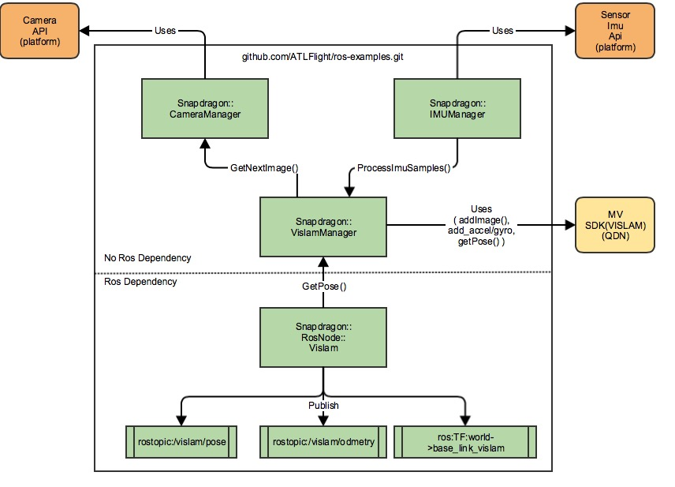
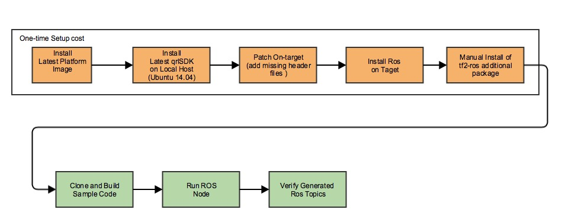
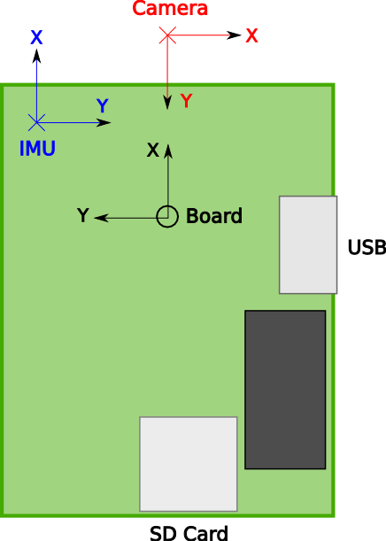

# Snapdragon Flight VISLAM-ROS Sample Code

This repo provides the sample code and instructions to run Visual-Inertial Simultaneous Localization And Mapping (VISLAM) as a ROS node on the [Qualcomm Snapdragon Platform](https://developer.qualcomm.com/hardware/snapdragon-flight)<sup>TM</sup>.

This example assumes that you are familiar with ROS framework.  If you are new to ROS, refer to [ROS Start Guide](http://wiki.ros.org/ROS/StartGuide) first to get started.

1. [High-Level Block Diagram](#high-level-block-diagram)
1. [Setup and build process](#setup-and-build-process)
   * [Pre-requisites](#pre-requisites)
      * [Platform BSP](#platform-bsp)
      * [Cross-Compile Build Environment](#cross-compile-build-environment)
      * [Install ROS on Snapdragon Platform](#install-ros-on-snapdragon-platform)
      * [Install Snapdragon Machine Vision SDK](#install-snapdragon-machine-vision-sdk)
      * [Machine Vision SDK License Installation](#machine-vision-sdk-license-installation)
   * [Clone and build sample code](#clone-and-build-sample-code)
1. [Run sample code](#run-sample-code)
   * [Start roscore](#start-roscore)
   * [Start imu_app application](#start-imu_app-application)
   * [Start VISLAM ROS node](#start-vislam-ros-node)
   * [Verification](#verification)
1. [Snapdragon Machine Vision VISLAM FAQ's](#snapdragon-machine-vision-vislam-faqs)
   * [VISLAM IMU to Camera Transformation(tbc/ombc)](#imu-to-camera-transformation)

## High-Level Block Diagram


## Setup and build process

The current build process is supported only on-target (i.e. on the Snapdragon Flight<sup>TM</sup> Board).  Future release(s) will support off-target cross-compilation on a host computer.

The following is an overall workflow for installation, build and execution of the ROS sample apps for Snapdragon Flight<sup>TM</sup>



### Pre-requisites

#### Platform BSP

These instructions were tested with version **Flight_3.1.2**. The latest version of the software can be downloaded from [here](http://support.intrinsyc.com/projects/snapdragon-flight/files) and  installed by following the instructions found [here](http://support.intrinsyc.com/projects/snapdragon-flight/wiki)

**NOTE**: By default the HOME environment variable is not set.  Set this up doing the following:

```
adb shell
chmod +rw /home/linaro
echo "export HOME=/home/linaro/" >> /home/linaro/.bashrc
```

If you use SSH, the home environment variable should be set correct after the above step.
If you use ADB, do the following for each session:

```
adb shell
source /home/linaro/.bashrc
```

#### Cross-Compile Build Environment

Get the latest Snapdragon Flight<sup>TM</sup> qrlSDK for your Ubuntu 14.04 host computer by following the instructions [here](https://github.com/ATLFlight/ATLFlightDocs/blob/master/AppsGettingStarted.md)

**NOTE**: For this example, you will need the qrlSDK to get the missing files on to the target (see below).


  1. Platform build setup for camera headers

    **NOTE**: For on-target camera development there are few header files missing on the target, but are part of the qrlSDK.  To fix this, the missing files need to be pushed on to the target.
    This is an interim solution and will be addressed in future releases.

    Push the following missing files to the target:

```
cd <sdk_root_install_path>/sysroots/eagle8074/usr/include
adb push camera.h /usr/include
adb push camera_parameters.h /usr/include
adb shell sync
```

#### Install ROS on Snapdragon Platform.

Refer to the following [page](https://github.com/ATLFlight/ATLFlightDocs/blob/master/SnapdragonROSInstallation.md) for ROS installation on Snapdragon Flight<sup>TM</sup> platform.

#### Install Snapdragon Machine Vision SDK

* Download the Snapdragon Machine Vision SDK from [here](https://developer.qualcomm.com/sdflight-tools)
* The package name will be mv\<version\>.deb.
** Example: *mv0.8.deb*
* push the deb package to the target and install it.

```
adb push mv<version>.deb /home/linaro
adb shell sync
adb shell
dpkg -i /home/linaro/mv<version>.deb
echo "export MV_SDK=/opt/qualcomm/mv/lib/mv" >> /home/linaro/.bashrc
```

#### Machine Vision SDK License Installation

The Machine Vision SDK will need a license file to run.  Obtain a research and development license file from [here](https://developer.qualcomm.com/sdflight-key-req)

The license file needs to be placed at the same location as the MV SDK library **libmv.so**.

Push the license file to the target using the following command:

```
adb push snapdragon-flight-license.bin /opt/qualcomm/mv/lib/mv/bin/lin/8x74/
adb shell sync
```

### Clone and build sample code

#### Setup ROS workspace on target

```
adb shell
source /home/linaro/.bashrc
mkdir -p /home/linaro/ros_ws/src
cd /home/linaro/ros_ws/src
catkin_init_workspace
cd ../
catkin_make
echo "source /home/linaro/ros_ws/devel/setup.bash" >> /home/linaro/.bashrc
```

This ensures that the ROS workspace is setup correctly.

#### Clone the sample code
* The repo may be cloned from [here]( from https://github.com/ATLFlight/ros-examples.git) directly on the target, or cloned on the host computer and then pushed to the target using ADB. The recommended method is to clone directly on the target.

```
adb shell
source /home/linaro/.bashrc
roscd
cd ../src
git clone https://github.com/ATLFlight/ros-examples.git snap_ros_examples
```

* Build the code

```
adb shell
source /home/linaro/.bashrc
roscd
cd ..
catkin_make snap_vislam_node
```

**NOTE**: To clean the code, remove the "build" folder

```
adb shell
source /home/linaro/.bashrc
roscd
cd ../
rm -rf build
```

## Run sample code

This example assumes that the user is familiar with ROS framework.  If you are new to ROS, refer to [ROS Start Guide](http://wiki.ros.org/ROS/StartGuide) first to get started.

This assumes that the ROS build command is successful.

**NOTE**: This process is for running VISLAM in standalone mode only.  Integration with a flight stack such as PX4 is not verified.

**NOTE**: The steps below show each application to be run in a separate adb shell.  This is for illustration purpose only.  The applications, like **rocore**, **imu_app**, **snap_vislam_node** can be run in the background to meet your development/runtime workflow.

### Start roscore
Start roscore in a shell as follows:

```
adb shell
source /home/linaro/.bashrc
roscore
```

### Start imu_app application

Starting the **imu_app** is **MANDATORY**.  Without this, the sample code will not run and the behavior is unpredictable.  **imu_app** is already pre-installed on the target.

For VISLAM to work, it needs the IMU data.  On Snapdragon Flight<sub>TM</sub>, the MPU9x50(IMU) is connected to the ADSP and the Snapdragon Flight<sub>TM</sub> supports an Apps processor API to get the IMU Data from ADSP.  Start the imu_app before using the API to retrieve IMU data.

**NOTE**: Staring the **imu_app** will initialize the MPU9x50 driver on ADSP.  There can be only one app that initilizes the MPU9x50 driver on ADSP.  If there are more than one app that intializes the MPU9x50 driver, the attempts after the first one, will fail.

Run **imu_app** in a shell.

```
adb shell
imu_app -s 2
```

To verify that it works, run the following command in a different shell instance (optional):

```
adb shell
sensor_imu_tester 5
```

The app runs for 5 seconds and collects the IMU data received from the ADSP. It would generate a few IMU_*.txt files. If these files get generated and they contain IMU samples, then the IMU data reception mechanism on apps processor works fine.

### Start VISLAM ROS node
To start the "snap_vislam_node" ROS node, the 2 steps above: [start roscore](#start-roscore) and [start imu_app](#start_imu_app_application) should be completed to make this work.

```
adb shell
source /home/linaro/.bashrc
rosrun snap_ros_examples snap_vislam_node
```

### Verification
If the above steps are complete and the applications starts successfully, the snap_vislam_node will publish /vislam/pose and /vislam/odometry topics. To view these topics, use the rostopic echo command.

```
adb shell
source /home/linaro/.bashrc
rostopic echo /vislam/pose
```

## Snapdragon Machine Vision VISLAM FAQs

### I do not see any ROS vislam/pose topic when I run the snap_ros_node

VISLAM requires a minimum set of points to initialize correctly.  If the points are not detected, the pose quality reported by the algorithm is "FAIL" or "INITIALIZING".   In this case, there won't be any ROS vislam/pose topics published. One scenario is if board is laying on a surface and the downward camera is very close to the surface.

To fix this, lift up the board a few inches from the surface and set it stationary for few seconds until the initalization is complete.  Once completed, you should see the ROS vislam/pose topics published.

The VISLAM algorithm has a parameter, "noInitWhenMoving", that allows to enable or disable initialization when moving. The current example sets this parameter to be **true**, and hence you need to keep the board stationary.  To change the parameter edit the [SnapdragonRosNodeVislam.cpp](src/nodes/SnapdragonRosNodeVislam.cpp) file as follows:

```
  vislamParams.noInitWhenMoving = false;
```

Once the change is done, recompile the code and re-test.

**NOTE**: Allowing for initialization when board is moving will potentially give bad VISLAM pose information.  The recommended setting is as used in the example.

### I do see the ROS vislam/pose topics published how do I verify if the VISLAM is working?

The example demonstrates console echo for vislam/pose information.  To validate if the vislam/pose is correct, you can move the board exercising all 6DOF motion to see the x,y,z changes in both the linear and rotational axes.  For example, if you move the board up and down, the "z" axes of the linear pose should change.  Similarily if you rotate the board on the "z" axes, the "z" value for the quaternion form should change.  See the [ROS pose message](http://docs.ros.org/api/geometry_msgs/html/msg/Pose.html) for the details on the pose message fields.

Since the example is generating a ROS topic, ROS visulation tool like RVIZ can be used to view the pose information. The RVIZ integration is left as an exercise for the user.

### How do I set my own values for the initial IMU-to-camera transformation? <a name="imu-to-camera-transformation"></a>

The transformation between the IMU and camera is required for initializing VISLAM. While VISLAM actively estimates this
transform, an accurate initial estimate is important. If you plan to change the location of the camera and/or IMU, you
will need to provide a new initial estimate for this transform.

The transform from IMU to camera is defined by the parameters called "tbc" and "ombc" for the translational and
rotational components, respectively. "b" refers to the body, or IMU, frame and "c" refers to the camera frame.

#### Coordinate frame conventions

The IMU coordinate frame is right-handed and defined as follows:

* X forward on the Snapdragon Flight board
* Y to the right of the board
* Z down with respect to the board

The camera coordinate frame is right-handed and defined as follows:

* X to the right in the image
* Y down in the image
* Z out of the camera (into the image)



#### Setting tbc and ombc

Given these coordinate frames, tbc and ombc values are found as follows:

* tbc is the position of the camera frame origin with respect to the IMU frame origin, written in the IMU coordinate frame, in meters.
* ombc is the associated rotation that transforms a vector in the camera frame to the IMU frame, converted to axis-angle
  representation (three components), in radians.

If the ombc is converted to a rotation matrix (R), it can be combined with the tbc (T) such that a vector in the camera
frame can be expressed in the IMU frame, X_IMU = R * X_camera + T.

The ombc uses axis-angle parameterization that has only three parameters. (See [here](https://en.wikipedia.org/wiki/Axis%E2%80%93angle_representation#Rotation_vector) ).
The X, Y, and Z components describe the vector about which we rotate, and the magnitude of this vector describes the magnitude of rotation.

The default values for tbc and ombc are provided in [SnapdragonRosNodeVislam.cpp](src/nodes/SnapdragonRosNodeVislam.cpp), which are

```
  vislamParams.tbc[0] = 0.005;    // X displacement [m]
  vislamParams.tbc[1] = 0.0150;   // Y displacement [m]
  vislamParams.tbc[2] = 0.0;      // Z displacement [m]

  vislamParams.ombc[0] = 0.0;     // rotation of 90 deg about Z
  vislamParams.ombc[1] = 0.0;     // rotation of 90 deg about Z
  vislamParams.ombc[2] = 1.57;    // rotation of 90 deg about Z
```

and describe the downward-facing camera shifted in X and Y, and rotated 90 degrees about the Z axis, with respect to the
IMU.

#### Verifying correct estimates

The VISLAM module provides the estimated transformation within the mvVISLAMPose struct, through the fields called "tbc"
and "Rbc". tbc is exactly as defined above. Rbc is the 3x3 rotation matrix describing ombc above. If the initial
estimates for tbc and ombc are correct, the values of tbc and Rbc should converge to values close to these initial
guesses. Convergence can be verified by plotting the mvVISLAMPose output after sufficient excitation of all six degrees of
freedom of the board (usually after 30 seconds of dynamic motion).
